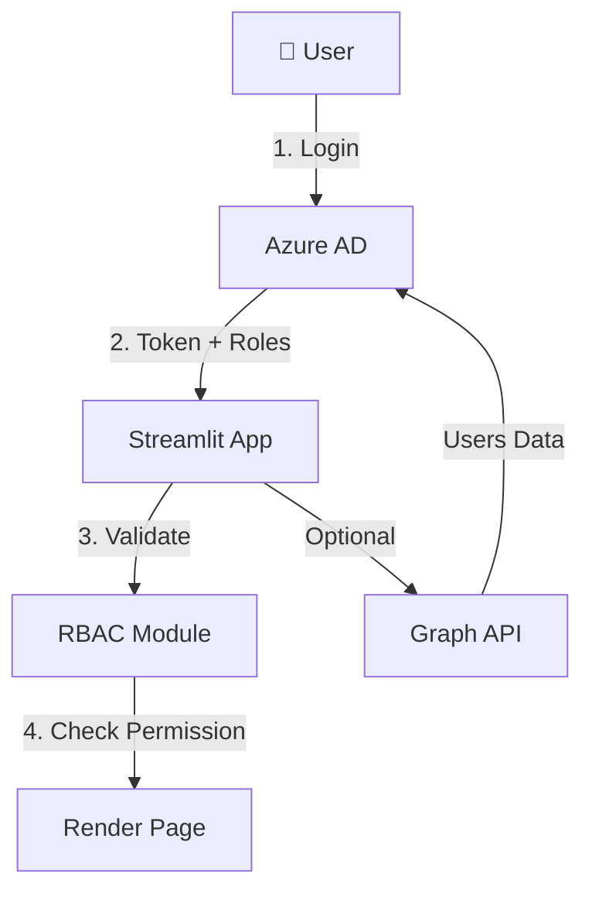

# Streamlit Azure AD SSO Template with RBAC

A **production-ready** Streamlit application template featuring Azure Active Directory Single Sign-On (SSO) with Role-Based Access Control (RBAC). Build secure, enterprise-grade applications with Microsoft authentication and granular permissions.

[](https://azure.microsoft.com/en-us/services/active-directory/)
[](https://streamlit.io/)
[](https://en.wikipedia.org/wiki/Role-based_access_control)

---

## 🚀 Quick Start

### **For First-Time Users**

1. **Setup Azure AD** (5 minutes)
   ```bash
   # 1. Copy environment template
   cp .env.example .env

   # 2. Edit .env with your Azure AD credentials
   # Get credentials from: Azure Portal → App registrations
   ```

2. **Install & Run** (2 minutes)
   ```bash
   pip install -r requirements.txt
   streamlit run app.py
   ```

3. **Configure RBAC** (5 minutes)
   - See [RBAC Quick Start Guide](RBAC_QUICK_START.md)

### **For Returning Users**

```bash
./restart.sh  # Clean restart with cache clearing
```

---

## 📋 Table of Contents

### **Getting Started**
- [Features](#-features)
- [What's Included](#-whats-included)
- [Prerequisites](#-prerequisites)
- [Installation](#-installation)

### **Core Functionality**
- [Authentication (SSO)](#-authentication-sso)
- [Role-Based Access Control](#-role-based-access-control-rbac)
- [User Management](#-user-management)
- [Project Structure](#-project-structure)

### **Documentation Hub**
- [Complete Documentation Guide](#-documentation-hub)
- [Quick Reference](#-quick-reference)

### **Advanced Topics**
- [Customization](#-customization)
- [Deployment](#-deployment)
- [Troubleshooting](#-troubleshooting)

---

## ✨ Features

### **Core Features**

- ✅ **Azure AD SSO Integration** - Enterprise-grade Microsoft authentication
- ✅ **Role-Based Access Control** - Three-tier permission system (Admin, Superuser, User)
- ✅ **Multipage Application** - Clean navigation with role-based page visibility
- ✅ **Persistent Sessions** - Secure cookie-based authentication (24-hour sessions)
- ✅ **User Management Dashboard** - Read-only user directory from Azure AD
- ✅ **Production Ready** - Security best practices, error handling, logging

### **Security Features**

- 🔒 **Secure Authentication** - OAuth 2.0 with MSAL library
- 🔒 **Role Validation** - Token-based role claims from Azure AD
- 🔒 **Session Security** - Secure cookies with SameSite=Strict
- 🔒 **Defense in Depth** - Multiple layers of access control
- 🔒 **No Database Required** - All user/role data managed in Azure AD

### **Developer Experience**

- 📦 **Modular Architecture** - Clean separation of concerns
- 📚 **Comprehensive Documentation** - Detailed guides for every feature
- 🎨 **Customizable UI** - Easy-to-modify Streamlit components
- 🔧 **Development Tools** - Restart script, debug helpers

---

## 🎯 What's Included

### **Pages**

| Page | Access Level | Description |
|------|-------------|-------------|
| 🏠 **Home** | All authenticated users | Dashboard with user info and role badge |
| 📊 **Analytics** | All authenticated users | Data visualization demo |
| ⚙️ **Settings** | Admin + Superuser | Application settings and preferences |
| 👥 **Users** | Admin only | User directory and role management |

### **Role Hierarchy**

```
🔴 Admin (Full Access)
├─ View Analytics ✅
├─ Manage Settings ✅
├─ Manage Users ✅
└─ All Permissions ✅

🟠 Superuser (Power User)
├─ View Analytics ✅
├─ Manage Settings ✅
└─ Cannot Manage Users ❌

🔵 User (Standard)
├─ View Analytics ✅
└─ Limited Access ⚠️
```

---

## 📋 Prerequisites

### **Required**

- **Python 3.8+**
- **Azure AD Tenant** (Free tier works!)
- **App Registration** in Azure AD
- **Microsoft Account** for testing

### **Azure AD Setup**

You'll need these from Azure Portal:

| Item | Where to Find |
|------|--------------|
| **Client ID** | App registrations → Your App → Overview |
| **Client Secret** | App registrations → Your App → Certificates & secrets |
| **Tenant ID** | Azure Active Directory → Overview |

**Detailed Setup**: See [RBAC Quick Start](RBAC_QUICK_START.md) → Azure AD configuration

---

## 🚀 Installation

### **Step 1: Clone & Setup**

```bash
# Navigate to project directory
cd "Streamlit/Template App"

# Create virtual environment (recommended)
python -m venv venv
source venv/bin/activate  # Windows: venv\Scripts\activate
```

### **Step 2: Install Dependencies**

```bash
pip install -r requirements.txt
```

**Includes:**
- `streamlit` - Web framework
- `msal` - Microsoft authentication
- `streamlit-cookie-controller` - Session management
- `requests` - Graph API calls
- `pandas` - Data handling

### **Step 3: Configure Environment**

```bash
# Copy example configuration
cp .env.example .env

# Edit .env with your credentials
nano .env  # or use any text editor
```

**Required in `.env`:**
```env
AZURE_CLIENT_ID=your_application_client_id
AZURE_CLIENT_SECRET=your_client_secret_value
AZURE_TENANT_ID=your_tenant_id
REDIRECT_URI=http://localhost:8501
```

### **Step 4: Run Application**

```bash
streamlit run app.py
```

**First Time?** You'll see the login page. Click "Sign in with Microsoft" to authenticate.

---

## 🔐 Authentication (SSO)

### **How It Works**

1. User clicks "Sign in with Microsoft"
2. Redirected to Azure AD login
3. User authenticates with Microsoft credentials
4. Azure returns authentication token with user info + roles
5. App validates token and creates session
6. User sees personalized dashboard

### **Session Management**

- **Duration**: 24 hours
- **Storage**: Secure HTTP-only cookies
- **Refresh**: Automatic from cookie on page reload
- **Security**: SameSite=Strict, HTTPS-only in production

**Technical Details**: See [Authentication Flow Diagram](README_RBAC.md#how-it-works)

---

## 🎭 Role-Based Access Control (RBAC)

### **Overview**

RBAC uses **Azure AD App Roles** - no database needed!

**How Roles Work:**
```
Azure AD → Assign Role to User → Role in JWT Token → App Enforces Permissions
```

### **Quick Setup (5 Minutes)**

1. **Create Roles in Azure AD**
   ```
   Azure Portal → App registrations → Your App → App roles
   Create: Admin, Superuser, User
   ```

2. **Assign Roles to Users**
   ```
   Azure Portal → Enterprise applications → Your App → Users and groups
   Add user → Select role → Assign
   ```

3. **Test**
   - Login with different users
   - Verify role badge and page visibility

**Complete Guide**: [RBAC Quick Start](RBAC_QUICK_START.md) (5-minute setup)
**Detailed Setup**: [Azure AD RBAC Setup](AZURE_AD_RBAC_SETUP.md) (step-by-step with screenshots)

### **Permission Matrix**

| Feature | Admin | Superuser | User |
|---------|-------|-----------|------|
| View Analytics | ✅ | ✅ | ✅ |
| Edit Settings | ✅ | ✅ | ❌ |
| Manage Users | ✅ | ❌ | ❌ |
| All Pages | ✅ | Partial | Limited |

### **Code Usage**

**Protect a page:**
```python
from SSO import require_role, Role

@require_role(Role.ADMIN, Role.SUPERUSER)
def main():
    st.write("Admin or Superuser only")
```

**Check permission in code:**
```python
from SSO import has_permission, Permission

if has_permission(Permission.MANAGE_USERS):
    show_admin_features()
```

**More Examples**: [Implementation Summary](RBAC_IMPLEMENTATION_SUMMARY.md)

---

## 👥 User Management

### **Users Page (Admin Only)**

The Users page provides a **read-only dashboard** showing:

- ✅ Real users from your Azure AD
- ✅ Active/disabled account status
- ✅ Search and filter functionality
- ✅ Quick links to Azure portal for management

**Setup Graph API** (Optional - for real data):

1. Add permissions: `User.Read.All`
2. Grant admin consent
3. Restart app

**Without Graph API**: Shows sample data with setup instructions

**Complete Guide**: [Users Page README](USERS_PAGE_README.md)
**Setup Guide**: [Graph API Setup](GRAPH_API_SETUP.md)

---

## 📁 Project Structure

```
Template App/
│
├── 📄 app.py                          # Main application entry point
├── 📄 restart.sh                      # Clean restart script
├── 📄 requirements.txt                # Python dependencies
├── 📄 .env                            # Environment variables (not in git)
├── 📄 .env.example                   # Environment template
│
├── 📂 SSO/                            # Authentication & RBAC package
│   ├── __init__.py                   # Package exports
│   ├── config.py                     # Azure AD configuration
│   ├── auth.py                       # MSAL authentication
│   ├── session.py                    # Session & cookie management
│   ├── auth_utils.py                 # Auth helper functions
│   ├── rbac.py                       # ⭐ Role-based access control
│   └── graph_api.py                  # ⭐ Microsoft Graph API client
│
├── 📂 pages/                          # Multipage app pages
│   ├── 1_📊_Analytics.py            # Analytics dashboard (All users)
│   ├── 2_⚙️_Settings.py             # Settings page (Admin+Superuser)
│   └── 3_👥_Users.py                # ⭐ User management (Admin only)
│
├── 📂 utils/                          # Utility modules
│   ├── ui_components.py              # Reusable UI components
│   └── auth_handler.py               # Auth flow handler
│
└── 📂 Documentation/                  # All guides (see below)
    ├── README.md                      # This file
    ├── RBAC_QUICK_START.md           # 5-minute RBAC setup
    ├── AZURE_AD_RBAC_SETUP.md        # Complete RBAC guide
    ├── RBAC_IMPLEMENTATION_SUMMARY.md # Technical details
    ├── README_RBAC.md                # RBAC overview
    ├── USERS_PAGE_README.md          # Users page guide
    └── GRAPH_API_SETUP.md            # Graph API configuration
```

**⭐ = New RBAC features**

---

## 📚 Documentation Hub

### **Start Here (New Users)**

| Document | Description | Time |
|----------|-------------|------|
| [README.md](README.md) | **This file** - Complete overview | 10 min |
| [RBAC_QUICK_START.md](RBAC_QUICK_START.md) | **5-minute RBAC setup** | 5 min |
| [README_RBAC.md](README_RBAC.md) | RBAC overview and concepts | 5 min |

### **Setup & Configuration**

| Document | Purpose | Audience |
|----------|---------|----------|
| [AZURE_AD_RBAC_SETUP.md](AZURE_AD_RBAC_SETUP.md) | Complete RBAC configuration guide | Admins |
| [GRAPH_API_SETUP.md](GRAPH_API_SETUP.md) | Graph API permissions setup | Admins |
| [USERS_PAGE_README.md](USERS_PAGE_README.md) | Users page features & setup | Admins |

### **Technical Documentation**

| Document | Purpose | Audience |
|----------|---------|----------|
| [RBAC_IMPLEMENTATION_SUMMARY.md](RBAC_IMPLEMENTATION_SUMMARY.md) | Architecture & technical details | Developers |
| Code Comments | Inline documentation | Developers |

### **Legacy Documentation**

| Document | Description |
|----------|-------------|
| [MULTIPAGE_GUIDE.md](MULTIPAGE_GUIDE.md) | Multipage app setup (pre-RBAC) |
| [MULTIPAGE_SUMMARY.md](MULTIPAGE_SUMMARY.md) | Multipage architecture |
| [PAGE_VISIBILITY.md](PAGE_VISIBILITY.md) | Page visibility controls |
| [PRODUCTION_CHECKLIST.md](PRODUCTION_CHECKLIST.md) | Production deployment checklist |
| [SECURITY_UPDATES.md](SECURITY_UPDATES.md) | Security improvements log |

---

## 🗺️ Quick Reference

### **Common Tasks**

| Task | Documentation | Command/Link |
|------|--------------|--------------|
| **Install app** | [Installation](#-installation) | `pip install -r requirements.txt` |
| **Run app** | - | `streamlit run app.py` |
| **Setup RBAC** | [RBAC Quick Start](RBAC_QUICK_START.md) | 5 minutes |
| **Assign roles** | [RBAC Setup](AZURE_AD_RBAC_SETUP.md#step-2-assign-roles-to-users) | Via Azure Portal |
| **Enable user list** | [Graph API Setup](GRAPH_API_SETUP.md) | Add permissions |
| **Troubleshoot** | [Troubleshooting](#-troubleshooting) | See below |

### **Important URLs**

| Resource | URL |
|----------|-----|
| **Azure Portal** | https://portal.azure.com |
| **App Registrations** | Azure AD → App registrations |
| **Enterprise Apps** | Azure AD → Enterprise applications |
| **Assign Roles** | Enterprise Apps → Your App → Users and groups |

---

## 🎨 Customization

### **Adding New Pages**

1. **Create page file** in `pages/` directory:
   ```python
   # pages/4_📈_Reports.py
   from SSO import require_role, Role

   @require_role(Role.ADMIN)
   def main():
       st.write("Reports page")

   if __name__ == "__main__":
       main()
   ```

2. **Update sidebar logic** in `app.py` (if needed for visibility)

3. **Define permissions** in `SSO/rbac.py` (optional)

**See**: [Implementation Summary](RBAC_IMPLEMENTATION_SUMMARY.md#extending-the-system)

### **Adding New Roles**

1. **Create in Azure AD**: App roles → Add role
2. **Update code**: `SSO/rbac.py` → Add to `Role` enum
3. **Define permissions**: Update `ROLE_PERMISSIONS` mapping

**See**: [Customizing Roles](AZURE_AD_RBAC_SETUP.md#customizing-roles)

### **Customizing UI**

**Change colors:**
```python
# In SSO/rbac.py - render_role_badge()
colors = {
    Role.ADMIN: "#FF4B4B",      # Change to your color
    Role.SUPERUSER: "#FFA500",
    Role.USER: "#0068C9",
}
```

**Add custom CSS:**
```python
# In app.py
st.markdown("""
    <style>
        .stButton>button {
            background-color: #0078D4;
        }
    </style>
""", unsafe_allow_html=True)
```

---

## 🚀 Deployment

### **Production Checklist**

Before deploying to production:

- [ ] Environment variables secured (not in source control)
- [ ] HTTPS configured (required for secure cookies)
- [ ] Redirect URI updated in Azure AD
- [ ] Client secret rotation schedule defined
- [ ] Admin users documented
- [ ] Monitoring/logging enabled
- [ ] Graph API permissions granted (if using Users page)

**Complete Checklist**: [Production Checklist](PRODUCTION_CHECKLIST.md)

### **Hosting Options**

- **Streamlit Community Cloud** - Free hosting
- **Azure App Service** - Integrated with Azure AD
- **Docker** - Use provided Dockerfile
- **AWS/GCP** - Standard deployment

**Note**: Update `REDIRECT_URI` in `.env` and Azure AD for production URL

---

## 🐛 Troubleshooting

### **Common Issues**

| Issue | Cause | Solution |
|-------|-------|----------|
| **ImportError: cannot import 'has_permission'** | Python cache | Run `./restart.sh` or clear `__pycache__` |
| **Configuration Error** | Missing `.env` | Copy `.env.example` → `.env` and fill in |
| **Authentication Failed** | Wrong credentials | Verify Azure AD Client ID, Secret, Tenant ID |
| **Access Denied** | Wrong role | Check role assignment in Azure Portal |
| **No roles showing** | Token missing roles | Add "roles" claim in Token configuration |
| **Graph API not working** | Missing permissions | Add `User.Read.All`, grant admin consent |

### **Debug Steps**

1. **Check environment**:
   ```bash
   # Verify .env exists and has values
   cat .env
   ```

2. **Clear Python cache**:
   ```bash
   ./restart.sh
   # Or manually:
   find . -type d -name __pycache__ -exec rm -rf {} +
   ```

3. **View token claims** (temporary debug):
   ```python
   # In app.py, after authentication
   st.write("Debug - User Info:", st.session_state.user_info)
   st.write("Debug - Roles:", st.session_state.user_info.get("roles", []))
   ```

4. **Check Azure AD logs**:
   - Azure Portal → Azure AD → Sign-in logs
   - Look for failed authentication attempts

### **Get Help**

1. Check relevant documentation (see [Documentation Hub](#-documentation-hub))
2. Review error messages in console
3. Check Azure AD audit logs
4. Verify all setup steps completed

---

## 🔒 Security

### **Best Practices**

✅ **Implemented by Default:**
- Secure cookies (SameSite=Strict, Secure flag in production)
- Token-based authentication (OAuth 2.0)
- Role validation from trusted source (Azure AD)
- No sensitive data in source control (.env in .gitignore)
- Defense in depth (multiple access control layers)

⚠️ **Your Responsibility:**
- Keep Azure AD credentials secure
- Rotate client secrets regularly (6-12 months)
- Use HTTPS in production
- Review role assignments regularly
- Monitor Azure AD sign-in logs

**Security Details**: [Security Updates](SECURITY_UPDATES.md)

---

## 📊 Architecture

### **High-Level Overview**



### **Authentication Flow**

```
User → Click Login → Azure AD → Authenticate → Return Token
→ App Validates → Extract Roles → Check Permissions → Render UI
```

### **RBAC Flow**

```
Page Load → Decorator @require_role → Check session_state.user_info.roles
→ Has Role? → Yes: Render Page | No: Access Denied
```

**Detailed Architecture**: [Implementation Summary](RBAC_IMPLEMENTATION_SUMMARY.md#architecture)

---

## 🤝 Contributing

This is a template for your use! Feel free to:

- Customize for your needs
- Add new features
- Modify UI/UX
- Extend RBAC permissions
- Create new pages

**No pull requests needed** - this is your starting point!

---

## 📄 License

This template is provided as-is for demonstration and educational purposes.

---

## 📚 Additional Resources

### **Microsoft Documentation**

- [Azure AD Overview](https://docs.microsoft.com/en-us/azure/active-directory/)
- [App Roles](https://docs.microsoft.com/en-us/azure/active-directory/develop/howto-add-app-roles-in-azure-ad-apps)
- [Microsoft Graph API](https://docs.microsoft.com/en-us/graph/)
- [MSAL Python](https://msal-python.readthedocs.io/)

### **Streamlit Documentation**

- [Streamlit Docs](https://docs.streamlit.io/)
- [Multipage Apps](https://docs.streamlit.io/library/get-started/multipage-apps)
- [Session State](https://docs.streamlit.io/library/api-reference/session-state)

### **Security Resources**

- [OAuth 2.0 Overview](https://oauth.net/2/)
- [RBAC Best Practices](https://docs.microsoft.com/en-us/azure/role-based-access-control/best-practices)
- [OWASP Top 10](https://owasp.org/www-project-top-ten/)

---

## 🎉 What's Next?

1. **Complete Setup**: Follow [RBAC Quick Start](RBAC_QUICK_START.md)
2. **Assign Roles**: See [Azure AD RBAC Setup](AZURE_AD_RBAC_SETUP.md)
3. **Enable Users Page**: Optional - [Graph API Setup](GRAPH_API_SETUP.md)
4. **Customize**: Add your own pages and features
5. **Deploy**: Use [Production Checklist](PRODUCTION_CHECKLIST.md)

---

<div align="center">

**Built with ❤️ using Streamlit and Azure AD**

[Get Started](#-quick-start) • [Documentation](#-documentation-hub) • [Troubleshooting](#-troubleshooting)

</div>
