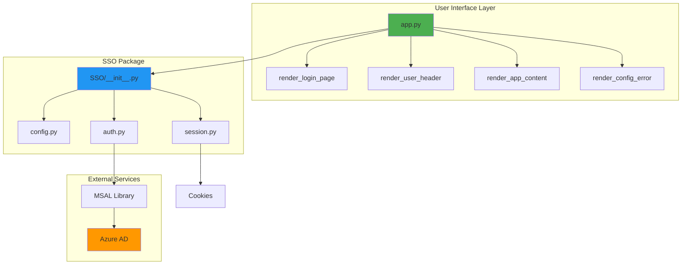
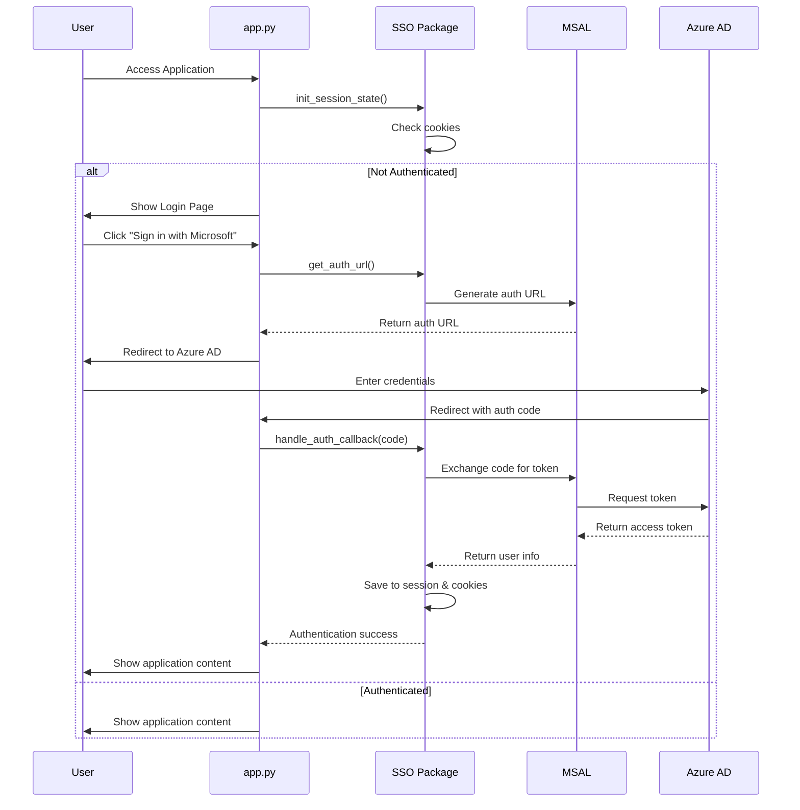
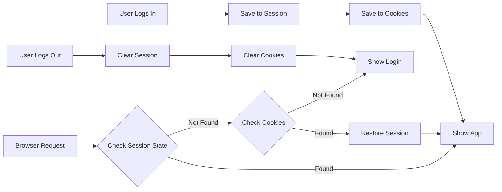
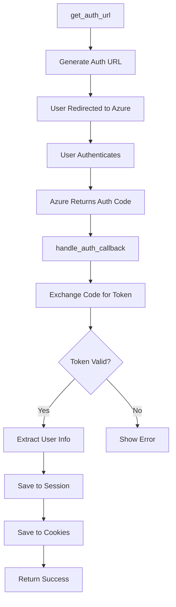
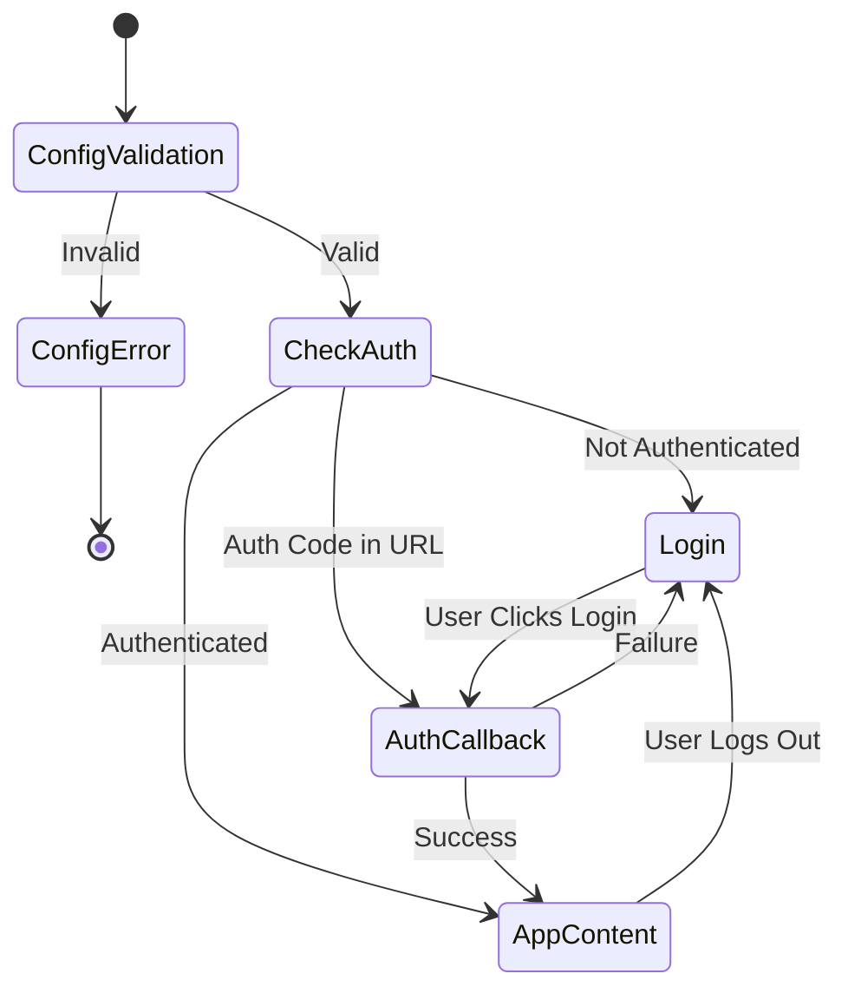
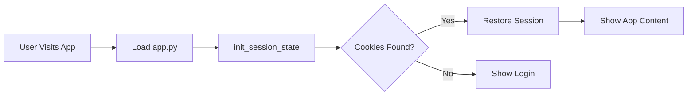
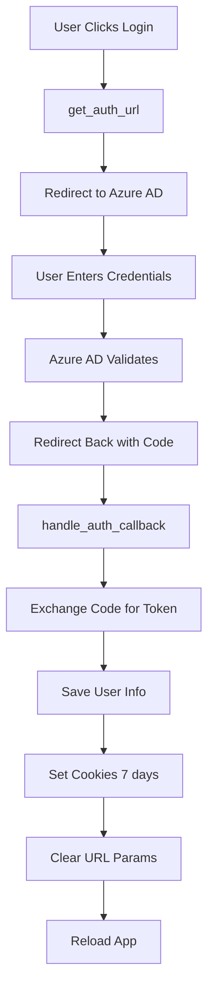
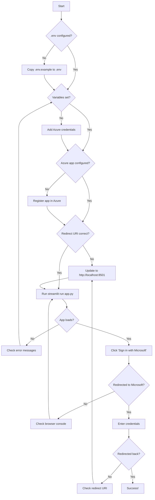

# Template for Streamlit

A production-ready Streamlit application template with Azure Active Directory Single Sign-On (SSO) authentication. This template features a clean, modular architecture that separates authentication logic from UI components.

## 📋 Table of Contents

- [Features](#features)
- [Architecture](#architecture)
- [Project Structure](#project-structure)
- [Prerequisites](#prerequisites)
- [Installation](#installation)
- [Configuration](#configuration)
- [How It Works](#how-it-works)
- [Module Documentation](#module-documentation)
- [Authentication Flow](#authentication-flow)
- [Customization](#customization)
- [Troubleshooting](#troubleshooting)

---

## ✨ Features

- **Azure AD SSO Integration** - Secure authentication using Microsoft accounts
- **Persistent Sessions** - Cookie-based session management for seamless user experience
- **Modular Architecture** - Clean separation between authentication logic and UI
- **Production Ready** - Environment validation, error handling, and security best practices
- **Easy Customization** - Simple UI components to build your application

---

## 🏗️ Architecture

The application follows a modular architecture with clear separation of concerns:



### Design Principles

1. **Separation of Concerns** - UI logic separated from authentication logic
2. **Single Responsibility** - Each module handles one specific aspect
3. **Dependency Injection** - Cookie controller passed as parameter
4. **State Management** - Centralized session state handling

---

## 📁 Project Structure

```
Streamlit SSO/
│
├── app.py                      # Main application (UI/UX focused)
├── README.md                   # This file
├── .env                        # Environment variables (not in git)
├── .env.example               # Example environment configuration
├── requirements.txt           # Python dependencies
│
└── SSO/                       # SSO Authentication Package
    ├── __init__.py           # Package exports
    ├── config.py             # Azure AD configuration
    ├── auth.py               # MSAL authentication logic
    └── session.py            # Session & cookie management
```

### File Responsibilities

| File | Purpose | Key Functions |
|------|---------|---------------|
| `app.py` | Main UI application | `render_*()` functions for UI components |
| `SSO/config.py` | Configuration management | `validate_config()`, `check_env_file()` |
| `SSO/auth.py` | Authentication flow | `get_auth_url()`, `handle_auth_callback()` |
| `SSO/session.py` | Session persistence | `init_session_state()`, `logout()` |

---

## 📋 Prerequisites

- Python 3.8+
- Azure AD application registration
- Microsoft account for testing

### Azure AD Application Setup

1. **Register Application** in Azure Portal
   - Go to Azure Active Directory → App registrations
   - Click "New registration"
   - Set redirect URI to `http://localhost:8501`

2. **Configure API Permissions**
   - Add `User.Read` permission (Microsoft Graph)
   - Grant admin consent

3. **Create Client Secret**
   - Go to Certificates & secrets
   - Create new client secret
   - Save the secret value (shown only once)

4. **Note Down Values**
   - Application (client) ID
   - Directory (tenant) ID
   - Client secret value

---

## 🚀 Installation

### 1. Clone or Download

```bash
cd "Streamlit SSO"
```

### 2. Create Virtual Environment

```bash
python -m venv venv
source venv/bin/activate  # On Windows: venv\Scripts\activate
```

### 3. Install Dependencies

```bash
pip install streamlit msal python-dotenv streamlit-cookies-controller
```

Or create a `requirements.txt`:

```txt
streamlit>=1.28.0
msal>=1.24.0
python-dotenv>=1.0.0
streamlit-cookies-controller>=0.0.2
```

Then install:

```bash
pip install -r requirements.txt
```

### 4. Configure Environment

```bash
cp .env.example .env
```

Edit `.env` with your Azure AD credentials:

```env
AZURE_CLIENT_ID=your_application_client_id
AZURE_CLIENT_SECRET=your_client_secret
AZURE_TENANT_ID=your_tenant_id
REDIRECT_URI=http://localhost:8501
```

### 5. Run Application

```bash
streamlit run app.py
```

---

## ⚙️ Configuration

### Environment Variables

| Variable | Required | Description | Example |
|----------|----------|-------------|---------|
| `AZURE_CLIENT_ID` | Yes | Application (client) ID from Azure | `a1b2c3d4-...` |
| `AZURE_CLIENT_SECRET` | Yes | Client secret value | `xyz123...` |
| `AZURE_TENANT_ID` | Yes | Directory (tenant) ID | `e5f6g7h8-...` |
| `REDIRECT_URI` | No | OAuth redirect URI | `http://localhost:8501` |

### Session Configuration

Sessions persist for **7 days** using browser cookies. This can be modified in `SSO/auth.py`:

```python
cookie_controller.set("authenticated", "true", max_age=604800)  # 7 days in seconds
```

---

## 🔄 How It Works

### Application Flow



### State Management

The application uses a combination of Streamlit session state and browser cookies:



---

## 📚 Module Documentation

### SSO/config.py

**Purpose**: Manage Azure AD configuration and validation

**Key Components**:

| Component | Type | Description |
|-----------|------|-------------|
| `CLIENT_ID` | Variable | Azure application client ID |
| `CLIENT_SECRET` | Variable | Azure client secret |
| `TENANT_ID` | Variable | Azure tenant ID |
| `REDIRECT_URI` | Variable | OAuth callback URL |
| `AUTHORITY` | Variable | Azure AD authority URL |
| `SCOPE` | Variable | Requested API permissions |
| `validate_config()` | Function | Validates environment variables |
| `check_env_file()` | Function | Checks if .env file exists |

**Example Usage**:

```python
from SSO import validate_config

config_valid, missing_vars = validate_config()
if not config_valid:
    print(f"Missing: {missing_vars}")
```

---

### SSO/auth.py

**Purpose**: Handle MSAL authentication operations

**Key Functions**:

| Function | Parameters | Returns | Description |
|----------|------------|---------|-------------|
| `get_msal_app()` | None | `ConfidentialClientApplication` | Creates MSAL client |
| `get_auth_url()` | None | `str` | Generates Azure AD login URL |
| `handle_auth_callback()` | `auth_code`, `cookie_controller` | `bool` | Processes auth callback |

**Authentication Process**:



**Example Usage**:

```python
from SSO import get_auth_url, handle_auth_callback, get_cookie_controller

# Get login URL
auth_url = get_auth_url()

# Handle callback
cookie_controller = get_cookie_controller()
success = handle_auth_callback(auth_code, cookie_controller)
```

---

### SSO/session.py

**Purpose**: Manage session state and cookie persistence

**Key Functions**:

| Function | Parameters | Returns | Description |
|----------|------------|---------|-------------|
| `get_cookie_controller()` | None | `CookieController` | Returns cached cookie controller |
| `init_session_state()` | None | None | Initializes session from cookies |
| `logout()` | None | None | Clears session and cookies |

**Session State Variables**:

| Variable | Type | Description |
|----------|------|-------------|
| `authenticated` | `bool` | User authentication status |
| `user_info` | `dict` | User profile information |
| `auth_code_processed` | `bool` | Prevents duplicate auth processing |

**Example Usage**:

```python
from SSO import init_session_state, logout
import streamlit as st

# Initialize session
init_session_state()

# Check authentication
if st.session_state.authenticated:
    user_name = st.session_state.user_info.get("name")
    print(f"Welcome {user_name}!")

# Logout
logout()
```

---

### app.py

**Purpose**: Main application with UI/UX components

**UI Functions**:

| Function | Purpose | When Called |
|----------|---------|-------------|
| `render_config_error()` | Show configuration errors | Missing environment variables |
| `render_login_page()` | Display login interface | User not authenticated |
| `render_user_header()` | Show user info & logout | User authenticated |
| `render_app_content()` | Main application content | User authenticated |
| `handle_auth_flow()` | Process OAuth callback | Auth code in URL |
| `main()` | Application entry point | App startup |

**Application States**:



---

## 🔐 Authentication Flow

### Step-by-Step Process

#### 1. Initial Access



#### 2. Login Process



#### 3. Session Persistence

| Event | Session State | Cookies | Result |
|-------|---------------|---------|--------|
| First Visit | Empty | Empty | Show login |
| After Login | Populated | Set (7 days) | Show app |
| Browser Refresh | Cleared | Persist | Restore from cookies |
| Explicit Logout | Cleared | Cleared | Show login |
| Cookie Expiry | May persist | Expired | Show login |

---

## 🎨 Customization

### Adding Your Application Content

Edit the `render_app_content()` function in `app.py`:

```python
def render_app_content():
    """Render the main application content for authenticated users."""
    st.divider()

    # Your custom content here
    st.header("My Custom Dashboard")

    # Example: Display user-specific data
    user_name = st.session_state.user_info.get("name", "User")
    st.write(f"Welcome back, {user_name}!")

    # Add your components
    col1, col2, col3 = st.columns(3)
    with col1:
        st.metric("Total Users", "1,234")
    with col2:
        st.metric("Active Sessions", "56")
    with col3:
        st.metric("Success Rate", "98%")

    # Your app logic here...
```

### Customizing Authentication Scope

To request additional Microsoft Graph permissions, edit `SSO/config.py`:

```python
# Request more permissions
SCOPE = [
    "User.Read",
    "Mail.Read",           # Read user's mail
    "Calendars.Read",      # Read user's calendar
    "Files.Read.All"       # Read user's files
]
```

**Note**: Additional permissions may require admin consent in Azure AD.

### Changing Session Duration

Modify cookie expiration in `SSO/auth.py`:

```python
# Change from 7 days to 30 days
cookie_controller.set("authenticated", "true", max_age=2592000)  # 30 days
```

### Custom Styling

Add custom CSS in `app.py`:

```python
def main():
    st.set_page_config(page_title="My App", layout="wide")

    # Custom CSS
    st.markdown("""
        <style>
        .stButton>button {
            background-color: #0078D4;
            color: white;
        }
        </style>
    """, unsafe_allow_html=True)

    # Rest of your app...
```

---

## 🐛 Troubleshooting

### Common Issues

| Issue | Cause | Solution |
|-------|-------|----------|
| "Configuration Error" | Missing `.env` variables | Verify all variables in `.env` file |
| "Authentication failed" | Invalid Azure credentials | Check Client ID, Secret, and Tenant ID |
| Redirect loop | Wrong redirect URI | Match Azure app registration exactly |
| Session not persisting | Cookies disabled | Enable browser cookies |
| "Invalid client secret" | Secret expired/wrong | Generate new secret in Azure |

### Debug Mode

Enable debug information by uncommenting lines in `SSO/session.py`:

```python
# Uncomment these lines in init_session_state()
st.sidebar.write("Debug - Cookies:", cookies)
st.sidebar.write("Debug - Session State Auth:", st.session_state.get("authenticated"))
```

### Checking Configuration

Run validation independently:

```python
from SSO import validate_config, check_env_file

# Check environment
print(f".env exists: {check_env_file()}")

# Validate config
valid, missing = validate_config()
if not valid:
    print(f"Missing variables: {missing}")
```

### Testing Authentication Flow



### Azure AD Errors

| Error Code | Meaning | Fix |
|------------|---------|-----|
| `AADSTS50011` | Invalid redirect URI | Update in Azure app registration |
| `AADSTS700016` | Application not found | Check Application ID |
| `AADSTS7000215` | Invalid client secret | Generate new secret |
| `AADSTS65001` | User consent required | Grant permissions in Azure |

### Getting Help

1. Check Azure AD sign-in logs in Azure Portal
2. Review Streamlit console output for errors
3. Enable debug mode in `SSO/session.py`
4. Verify network connectivity to Azure endpoints

---

## 📄 License

This template is provided as-is for demonstration and educational purposes.

## 🤝 Contributing

Feel free to customize and extend this template for your needs!

---

## 📚 Additional Resources

- [Azure AD Documentation](https://docs.microsoft.com/en-us/azure/active-directory/)
- [MSAL Python Documentation](https://msal-python.readthedocs.io/)
- [Streamlit Documentation](https://docs.streamlit.io/)
- [Microsoft Graph API](https://docs.microsoft.com/en-us/graph/)

---

**Built with ❤️ using Streamlit and Azure AD**